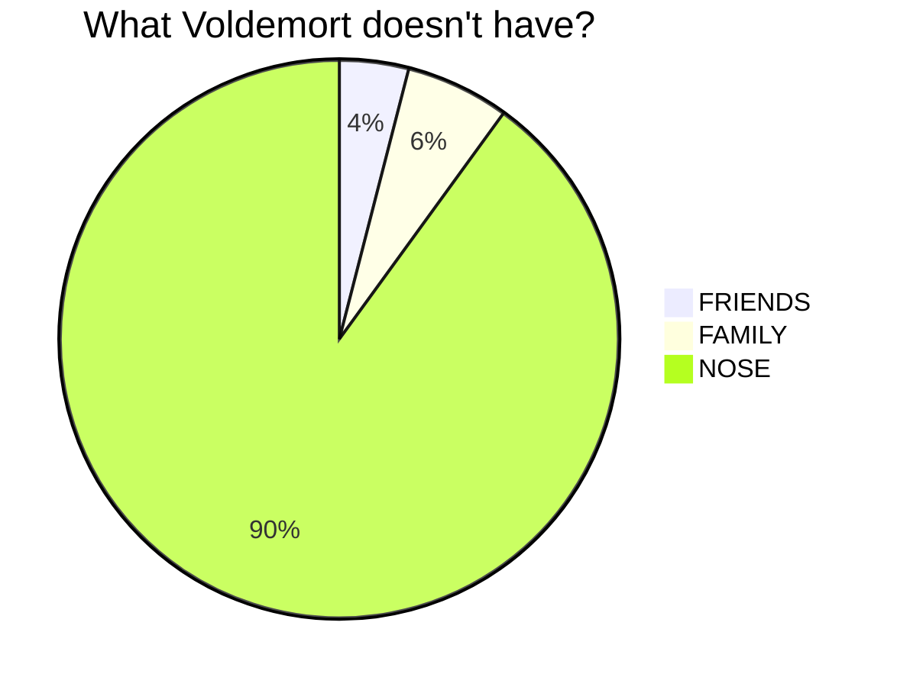

Hi, I’m Cybernetic-Ransomware
aka Aleksander
---
👨‍💻 About Me

I'm a passionate software developer currently working in a creative agency, with a diverse background in project management, ERP systems, and data warehousing. My journey started as a Project Manager in the machine construction industry, where I learned the importance of structure and process. I then transitioned into commercial implementing ERP systems, and later administering one of them, including working with T-SQL-based data warehouses.

Now, I’m focused on building pipelines solutions in the tech space, with a special emphasis on:

    Python 🐍 and Docker 🐳 for efficient and scalable software.
    Learning and experimenting with data flow and monitoring systems.
    Expanding my knowledge of web applications and backend development.

I’m also excited to dive deeper into:

    Go and Rust 🚀, as they represent the future of high-performance, concurrent applications.

🚀 Skills & Technologies

    Programming Languages: Python, T-SQL, M, JS (basics) Go (basics), Rust (basics), 
    Containers: Docker, Docker Compose, Kubernetes
    Data: T-SQL, Data Warehousing, ETL
    Systems: ERP Implementation & Administration (MS Dynamics, IFS, Comarch, Symfonia)
    Web Development: (Django, Flask, FastAPI)

📫 How to reach me:

Feel free to connect with me here on GitHub or via email at [aleksander.marszalkiewicz.pp@gmail.com].

