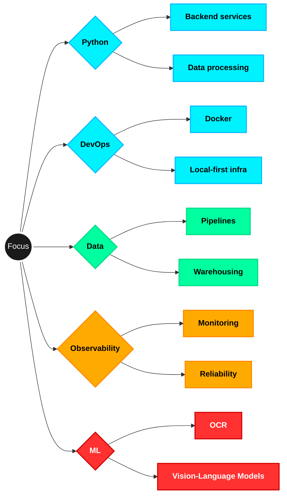
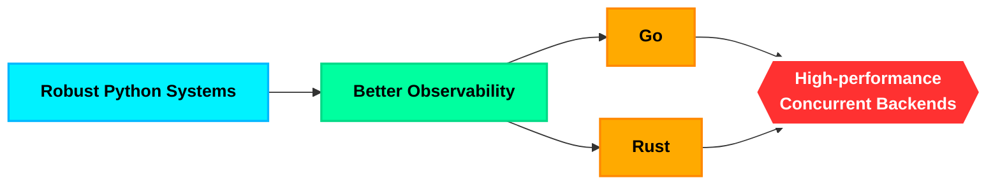

# Hi, I’m Cybernetic-Ransomware

**aka Aleksander Marszałkiewicz**

---

## 👨‍💻 About Me

I’m a **Python backend developer** with professional experience in building data‑heavy and service‑oriented systems. My work sits at the intersection of backend engineering, data pipelines, and DevOps, with growing hands‑on experience in applied machine learning.

I have over **4+ years of commercial Python experience**, a solid DevOps foundation, and practical exposure to **machine‑learning systems**, especially vision‑language models and OCR‑based pipelines.

Before moving fully into software development, I worked in **project management and industrial software implementations**, which left me with an unusually high tolerance for legacy systems, unclear requirements, and reality.

---

## 🔁 Professional Journey

```mermaid
flowchart LR
    %% Nodes
    PM(Project Management<br/>Industrial Systems)
    ERP(ERP Implementation<br/>& Administration)
    DW(Databases<br/>& Data Warehousing)
    PY(Python Backend<br/>Development)
    PIPE(Data Pipelines<br/>& Observability)
    ML(Applied ML<br/>& OCR Systems)

    %% Connections
    PM --> ERP --> DW --> PY --> PIPE --> ML

    %% True Neon Palette
    classDef nBlue fill:#00f2ff,stroke:#00b7ff,stroke-width:2px,color:#000,font-weight:bold;
    classDef nGreen fill:#00ff9f,stroke:#00d986,stroke-width:2px,color:#000,font-weight:bold;
    classDef nOrange fill:#ffaa00,stroke:#ff8800,stroke-width:2px,color:#000,font-weight:bold;
    classDef nRed fill:#ff3131,stroke:#d00000,stroke-width:2px,color:#fff,font-weight:bold;

    %% Apply Styles
    class PM,ERP nBlue;
    class DW,PY nGreen;
    class PIPE nOrange;
    class ML nRed;
```

---

## 🚀 Current Focus

```mermaid
flowchart LR
    %% Main Node
    root((Focus))

    %% Categories
    Py{Python}
    Dev{DevOps}
    Data{Data}
    Obs{Observability}
    ML{ML}

    %% Leaves
    Py1[Backend services]
    Py2[Data processing]
    Dev1[Docker]
    Dev2[Local-first infra]
    Data1[Pipelines]
    Data2[Warehousing]
    Obs1[Monitoring]
    Obs2[Reliability]
    ML1[OCR]
    ML2[Vision-Language Models]

    %% Connections
    root:::main --> Py:::nBlue & Dev:::nBlue & Data:::nGreen & Obs:::nOrange & ML:::nRed
    
    Py --> Py1:::nBlue & Py2:::nBlue
    Dev --> Dev1:::nBlue & Dev2:::nBlue
    Data --> Data1:::nGreen & Data2:::nGreen
    Obs --> Obs1:::nOrange & Obs2:::nOrange
    ML --> ML1:::nRed & ML2:::nRed

    %% True Neon Palette Styles
    classDef main fill:#1a1a1a,stroke:#fff,stroke-width:4px,color:#fff;
    classDef nBlue fill:#00f2ff,stroke:#00b7ff,stroke-width:2px,color:#000,font-weight:bold;
    classDef nGreen fill:#00ff9f,stroke:#00d986,stroke-width:2px,color:#000,font-weight:bold;
    classDef nOrange fill:#ffaa00,stroke:#ff8800,stroke-width:2px,color:#000,font-weight:bold;
    classDef nRed fill:#ff3131,stroke:#d00000,stroke-width:2px,color:#fff,font-weight:bold;
```

---

## 🧪 Technologies & Skills

### Programming & Backend
- Python (3.12+)
- FastAPI, Django
- Async & task queues (Celery)
    
### Data & Messaging
- Pandas, Polars
- PostgreSQL, TimescaleDB
- RabbitMQ, Kafka
- ETL & data warehousing
    
### DevOps & Infrastructure
- Docker, Docker Compose
- Kubernetes
- Local-first environments

### ML / AI Tooling
- OCR pipelines (Tesseract)  
- Vision‑Language Models
- Custom LoRAs
- Flux-dev, NVIDIA Nemotron, Gemma
- LangChain, LangSmith

---

## 🧭 Learning & Direction

```mermaid
flowchart LR
    %% Nodes
    A[Robust Python Systems]
    B[Better Observability]
    C[Go]
    D[Rust]
    E{{High-performance<br/>Concurrent Backends}}

    %% Flow
    A --> B
    B --> C & D
    C & D --> E

    %% True Neon Palette Styles
    classDef nBlue fill:#00f2ff,stroke:#00b7ff,stroke-width:2px,color:#000,font-weight:bold;
    classDef nGreen fill:#00ff9f,stroke:#00d986,stroke-width:2px,color:#000,font-weight:bold;
    classDef nOrange fill:#ffaa00,stroke:#ff8800,stroke-width:2px,color:#000,font-weight:bold;
    classDef nRed fill:#ff3131,stroke:#fff,stroke-width:4px,color:#fff,rx:10,ry:10,font-weight:bold;

    class A nBlue;
    class B nGreen;
    class C,D nOrange;
    class E nRed;
```

---

## 📫 Contact
- 📧 Email: [aleksander.marszalkiewicz@protonmail.com](mailto:aleksander.marszalkiewicz@protonmail.com)
- 🌐 Business card: [https://cr-business-card-single.statichost.page/](https://cr-business-card-single.statichost.page/)
- 📄 CV: available on the business site
    
I prefer concrete problems, clear ownership, and systems that survive contact with reality.
